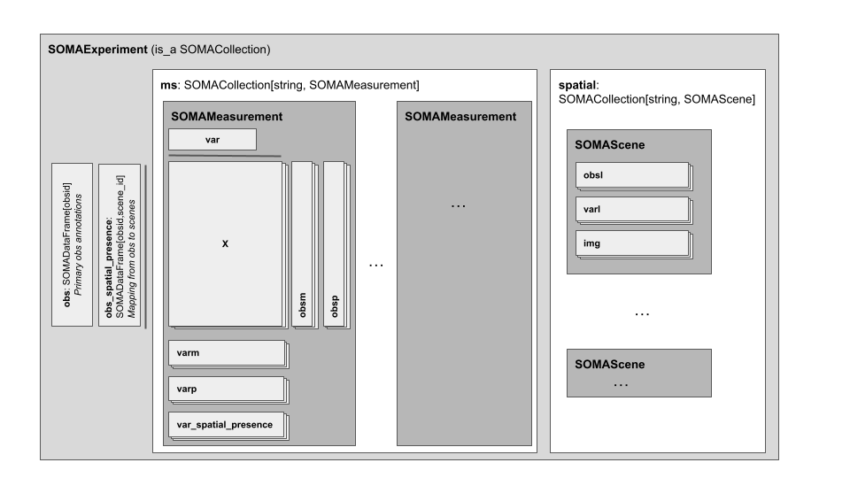

# Introduction

> **Status**: brainstorming, pre-proposal
>
> ℹ️ **Note** - this is an early draft and has not had any substantive review or circulation. It may contain controversial, undecided, or just plain wrong-headed ideas. I expect several major iterations will be required to converge the underlying primitives with use cases. Please see `issues` noted throughout the doc for a list of active discussions/debates. In particular, this doc has many known gaps identified throughout the with callouts.

The goal of SOMA (“stack of matrices, annotated”) is a flexible, extensible, and open-source API providing access to annotated, 2D matrix data stored in multiple underlying formats and systems. The vision for this API family includes:

- support access to persistent, cloud-resident datasets,
- enable use within popular data science environments (e.g., R, Python), using the tools of that environment (e.g., Python Pandas integration),
- enable access to data aggregations much larger than single-host main memory
- provide a building block for higher-level API that may embody domain-specific conventions or schema around annotated 2D matrices (e.g., a cell "atlas").

The SOMA data model is centered on annotated 2-D matrices, conceptually similar to commonly used single-cell 'omics data structures including Seurat Assay, Bioconductor SingleCellExperiment, and ScanPy AnnData. Where possible, the SOMA API attempts to be general purpose and agnostic to the specifics of any given environment, or to the specific conventions of the Single Cell scientific ecosystem.

SOMA is an abstract _API specification_, with the goal of enabling multiple concrete API implementations within different computing environments and data storage systems. SOMA does not specify an at-rest serialization format or underlying storage system.

This document is attempting to codify the abstract, language-neutral SOMA data model and functional operations. Other specifications will document specific language bindings and particular storage system implementations. Where the term `language-specific SOMA specification` is used below, it implies a specification of the SOMA API as it is presented in a given language or computing environment (e.g., the SOMA Python API), common across all storage engine implementations in that language.

# Data Model

The data model is comprised of two layers:

- a set of "foundational" types which are general in nature
- a set of "composed" types, which are composed from the foundational types, and are intended to improve ease of dataset use and interoperability

The foundational types are:

- SOMACollection - a string-keyed container (key-value map) of other SOMA data types, e.g., SOMADataFrame, SOMADataMatrix and SOMACollection.
- SOMADataFrame - a single- or multi-index, multi-column table, with monomorphic (i.e., of a single data type) columns of equal length -- essentially a dataframe.
- SOMANdArray - an offset indexed (zero-based), dense, single-typeN-D array.

The composed types are:

- SOMAExperiment - a specialization and extension of SOMACollection, codifying a set of naming and indexing conventions to represent annotated, 2-D matrix of observations across _multiple_ sets of variables.

In this document, the term `dataframe` implies something akin to an Arrow `RecordBatch`, R `data.frame` or Python `pandas.DataFrame`, where:

- multiple columns may exist, each with a string column name
- all columns are individually typed, monomorphic, and contain simple types (e.g., int64)
- all columns are of equal length
- one or more columns may be indexed

All SOMA data objects are named with URIs.

## Base Type System

The SOMA API borrows its base type system from the Arrow language-agnostic in-memory system for data typing and serialization ([format](https://arrow.apache.org/docs/format/Columnar.html)). The SOMA API is intended to be used with an Arrow implementation such as [PyArrow](https://arrow.apache.org/docs/python/) or the [Arrow R package](https://arrow.apache.org/docs/r/), or other libraries which interoperate with Arrow (e.g., Pandas).

Where SOMA requires an explicit typing system, it utilizes the Arrow types and schema. SOMA has no specific requirements on the type or serialization system used by the underlying storage engine, other than it be capable of understanding and representing the Arrow types. It is expected that any given implementation of SOMA will have limits on the underlying capabilities of its data type system (e.g., just because you can express a type in he Arrow type system does not mean all SOMA implementations will understand it).

### Type definitions used in this document

In the following doc:

- `primitive` types in this specification refer to Arrow primitive types, e.g., `int32`, `float`, etc.
- `string` refers to Arrow UTF-8 variable-length `string`, i.e., `List<Char>`.
- `simple` types include all primitive types, plus `string`.

Other Arrow types are explicitly noted as such, e.g., `Arrow RecordBatch`.

> ⚠️ **Issue** - are there parts of the Arrow type system that we wish to _explicitly exclude_ from SOMA? I have left this issue open (i.e., no specific text) for now, thinking that we can come back and subset as we understand what complex types are required, and how much flexibility should be in this spec. We clearly need some complex types (e.g., RecordBatch, List, etc) as they are implied by `string`, etc. My own preference would be to mandate a small set of primitive types, and leave the rest open to implementations to support as they feel useful.

> ⚠️ **Issue** - the above uses Arrow `string`. Should we be using `large_string` instead (no 2GB cap)?

## Metadata

All SOMA objects may be annotated with a small amount of metadata:

- `metadata` (map[string, simple]) - user metadata, specified as string-keyed mapping to any [**simple**](#type-definitions-used-in-this-document) type (e.g., int32, string, etc).

Only [`simple`](#type-definitions-used-in-this-document) types are supported as metadata values. The metadata lifecycle is the same as its containing object, e.g., it will be deleted when the containing object is deleted.

> ⚠️ **Issue** - do we need more complex metadata value types, and if so, how to represent capture what is supported? (e.g., anything Arrow can represent? a subset?)
>
> **Proposal**: restrict to a mapping of string keys and `simple` values. Extend to complex types in the future as we have concrete use cases which warrant the complexity.

## Foundational Types

The foundational types represent the core data structures used to store and index data. They are intended to be moderately general purpose, and to serve as building blocks for the [Composed Types](#composed-types) which codify domain-specific use cases (e.g., single cell experimental datasets).

### SOMACollection

SOMACollection is an unordered, `string`-keyed map of values. Values may be any SOMA foundational or composed type, including other (nested) SOMACollection objects. Keys in the map are unique and singular (no duplicates, i.e., the SOMACollection is _not_ a multi-map). The SOMACollection is expected to be used for a variety of use cases:

- as a container of independent objects (e.g., a collection of single-cell datasets, each manifest as a [SOMAExperiment](#soma-experiment) object)
- as the basis for building other composed types (e.g., using SOMACollection to organize pre-defined fields in [SOMAExperiment](#soma-experiment) such as multiple layers of `X`).

### SOMADataFrame

`SOMADataFrame` is a multi-index, multi-column table of monomorphic arrays, all of equal length. A `SOMADataFrame` has a user-defined schema, which defines the number of columns and their respective column name and value type. The schema is expressed as an Arrow `Schema`. All `SOMADataFrame` contain a "pseudo-column" called `__rowid`, of type `uint64` and domain `[0, #rows)`. The `__rowid` pseudo-column contains a unique value for each row in the `SOMADataFrame`, and is intended to act as a join key for other objects, such as a `SOMANdArray`.

A `SOMADataFrame` may be `user-indexed` or `row-indexed`:

- `row-indexed` - each row is addressable (indexed) by the pseudo-column `__rowid` (i.e., a single-index using offset indexing).
- `user-indexed` - each row is addressable (indexed) by one or more user-specified index columns, which must be named columns in the dataframe schema.

Row-indexed datafames must have no user-specified index columns and at least one column defined in their schema. User-indexed dataframes must have at least one schema-defined column named as an index column. The user-specified schema may not redefine the `__rowid` pseudo-column.

Most language-specific bindings will provide convertors between SOMADataFrame and other convenient data structures, such as Python `pandas.DataFrame`, R `data.frame`.

> ℹ️ **Note** - on a TileDB implementation, `row-indexed` SOMADataFrames will likely map to a _dense_ array, with a single uint64 dimension called **rowid, with domain [0 #nrows). A `user-indexed` SOMADataframe will be a _sparse_ array, with a dimension for each user-specified index column, and a hidden **rowid attribute.

### SOMADenseNdArray

`SOMADenseNdArray` is a monomorphic, dense, N-dimensional array with offset (zero-based) integer indexing on each dimension. The `SOMADenseNdArray` has a user-defined schema, which includes:

- type - a `primitive` type, expressed as an Arrow type (e.g., `int64`, `float32`, etc)
- shape - the shape of the array, i.e., number and length of each dimension

All dimensions must have a positive, non-zero length.

> ℹ️ **Note** - on TileDB this is an dense array with `N` uint64 dimensions of domain [0, maxUint64), and a single attribute.

### SOMASparseNdArray

`SOMASparseNdArray` is a monomorphic, sparse, N-dimensional array with offset (zero-based) integer indexing on each dimension. The `SOMASparseNdArray` has a user-defined schema, which includes:

- type - a `primitive` type, expressed as an Arrow type (e.g., `int64`, `float32`, etc)
- shape - the shape of the array, i.e., number and length of each dimension

All dimensions must have a positive, non-zero length.

> ℹ️ **Note** - on TileDB this is an sparse array with `N` uint64 dimensions of domain [0, maxUint64), and a single attribute.

## Composed Types

Composed types are defined as a composition of foundational types, adding name, type and indexing constraints. These types are intended to facilitate data interoperability, ease of use, and _potentially_ enable implementation optimizations by virtue of their typing and structural guarantees. The initial composed types are motivated by single cell biology, but additional types may be added in the future for more diverse use cases.

### SOMAExperiment & SOMAMeasurements

`SOMAExperiment` is a specialized `SOMACollection`, representing an annotated 2-D matrix of measurements. In the single-cell biology use case, a `SOMAExperiment` can represent multiple modes of measurement across a single collection of cells (aka a "multimodal dataset"). Within a `SOMAExperiment`, a set of measurements on a single set of variables (features) is represented as a `SOMAMeasurements`.

The SOMAExperiment and SOMAMeasurements types compose [foundational types](#foundational-types):

- SOMAExperiment - a well defined set of annotated observations defined by a SOMADataFRame, and one or more "measurement sets" on those observations.
- SOMAMeasurements - for all observables, a common set of annotated variables (defined by a SOMADataFrame) for which values (e.g., measurements, calculations) are stored in SOMADenseNdMatrix and SOMASparseNdMatrix.

In other words, all SOMAMeasurements have a distinct set of variables (features), and inherit common observables from their parent SOMAExperiment. The `obs` and `var` dataframes define the axis annotations, and their respective `__rowid` values are the indices for all matrixes stored in the SOMAMeasurements.

<figure>
    
</figure>

> ⚠️ **Issue** - it would be a good idea to factor SOMAExperiment and SOMAMeasurements into separate sections.

These types have pre-defined fields, each of which have well-defined naming, typing, dimensionality and indexing constraints. Other user-defined data may be added to a `SOMAExperiment` and `SOMAMeasurements`, as both are a specialization of the `SOMACollection`. Implementations _should_ enforce the constraints on these pre-defined fields. Pre-defined fields are distinguished from other user-defined collection elements, where no schema or indexing semantics are presumed or enforced.

The shape of each axis (`obs` and `var`) are defined by their respective dataframes, and the indexing of matrices is defined by the `__rowid` of the respective axis dataframe.

- `obs` - the observation annotations are shared across the entire `SOMAExperiment`. Matrices indexed on this dimension use the domain defined by the `__rowid` values of the `obs` SOMADataFrame (aka `obsid`).
- `var` - the variable annotations are shared within any given `SOMAMeasurements`. Matrices indexed on this dimension use the domain defined by the `__rowid` values of the `var` SOMADataFrame (aka `varid`).

The pre-defined fields of a SOMAExperiment object are:

| Field name | Field type                                 | Field description                                                                                                                                                                                                           |
| ---------- | ------------------------------------------ | --------------------------------------------------------------------------------------------------------------------------------------------------------------------------------------------------------------------------- |
| `obs`      | `SOMADataFrame`                            | Primary annotations on the _observation_ axis. The contents of the `__rowid` pseudo-column define the _observation_ index domain, aka `obsid`. All observations for the SOMAExperiment _must_ be defined in this dataframe. |
| `ms`       | `SOMACollection[string, SOMAMeasurements]` | A collection of named measurement sets.                                                                                                                                                                                     |

The SOMAMeasurements is a sub-element of a SOMAExperiment, and is otherwise a specialized SOMACollection with pre-defined fields:

| Field name | Field type                                  | Field description                                                                                                                                                                                                                                                                            |
| ---------- | ------------------------------------------- | -------------------------------------------------------------------------------------------------------------------------------------------------------------------------------------------------------------------------------------------------------------------------------------------- |
| `var`      | `SOMADataFrame`                             | Primary annotations on the _variable_ axis, for variables in this measurement set (i.e., annotates columns of `X`). The contents of the `__rowid` pseudo-column define the _variable_ index domain, aka `varid`. All variables for this measurement set _must_ be defined in this dataframe. |
| `X`        | `SOMACollection[string, SOMASparseNdArray]` | A collection of sparse matrices, each containing measured feature values. Each matrix is indexed by `[obsid, varid]`                                                                                                                                                                         |
| `obsm`     | `SOMACollection[string, SOMADenseNdArray]`  | A collection of dense matrices containing annotations of each _obs_ row. Has the same shape as `obs`, and is indexed with `obsid`.                                                                                                                                                           |
| `obsp`     | `SOMACollection[string, SOMASparseNdArray]` | A collection of sparse matrices containing pairwise annotations of each _obs_ row. Indexed with `[obsid_1, obsid_2].`                                                                                                                                                                        |
| `obs_ms`   | `SOMACollection[string, SOMADataFrame]`     | A collection of row-indexed dataframes, each containing _secondary_ annotations of each observation, specific to the SOMAMeasurements                                                                                                                                                        |
| `varm`     | `SOMACollection[string, SOMADenseNdArray]`  | A collection of dense matrices containing annotations of each _var_ row. Has the same shape as `var`, and is indexed with `varid`                                                                                                                                                            |
| `varp`     | `SOMACollection[string, SOMASparseNdArray]` | A collection of sparse matrices containing pairwise annotations of each _var_ row. Indexed with `[varid_1, varid_2]`                                                                                                                                                                         |
| `var_ms`   | `SOMACollection[string, SOMADataFrame]`     | A collection of row-indexed dataframes, each containing _secondary_ annotations of each variable, specific to the SOMAMeasurements                                                                                                                                                           |

For the entire SOMAExperiment, the index domain for the elements within `obsp`, `obsm`, `obs_ms` and `X` (first dimension) are the values defined by the `obs` SOMADataFrame `__rowid` column. For each SOMAMeasurements, the index domain for `varp`, `varm`, `var_ms` and `X` (second dimension) are the values defined by the `var` SOMADataFrame `__rowid` column in the same measurement set. In other words, all predefined fields in the SOMAMeasurements share a common `obsid` and `varid` domain, which is defined by the contents of the respective columns in `obs` and `var` SOMADataFrames.

As with other SOMACollections, the SOMAExperiment and SOMAMeasurements also have a `metadata` field, and may contain other user-defined elements.

> ⚠️ **Issue** - the utility of `obs_ms` and `var_ms` are still in debate, and we may remove them.

The following naming and indexing constraints are defined for the SOMAExperiment and SOMAMeasurements:

| Field name                                         | Field constraints                                                                                                                                                                                                                    |
| -------------------------------------------------- | ------------------------------------------------------------------------------------------------------------------------------------------------------------------------------------------------------------------------------------ |
| `obs`, `var`                                       | Field type is a `SOMADataFrame`                                                                                                                                                                                                      |
| `obs_ms`, `var_ms`,                                | Field type is a `SOMACollection`, and each element in the collection has a value of type `SOMADataFrame`                                                                                                                             |
| `obsp`, `varp`, `X`                                | Field type is a `SOMACollection`, and each element in the collection has a value of type `SOMASparseNdArray`                                                                                                                         |
| `obsm`, `varm`                                     | Field type is a `SOMACollection`, and each element in the collection has a value of type `SOMADenseNdArray`                                                                                                                          |
| `obs_ms`, `obsm`, `obsp`, `var_ms`, `varm`, `varp` | Fields may be empty collections.                                                                                                                                                                                                     |
| `X` collection values                              | All matrixes must have the shape `(#obs, #var)`. The domain of the first dimension is the values of `obs.__rowid`, and the index domain of the second dimension is the values of `var.__rowid` in the containing `SOMAMeasurements`. |
| `obsm` collection values                           | All matrixes must have the shape `(#obs, M)`, where `M` is user-defined. The domain of the first dimension is the values of `obs.__rowid`.                                                                                           |
| `obsp` collection values                           | All matrixes must have the shape `(#obs, #obs)`. The domain of both dimensions is the values of `obs.__rowid`.                                                                                                                       |
| `obs_ms` collection values                         | All dataframes must have the shape `(#obs,)`. The domain of the dimension is the values of `obs.__rowid`.                                                                                                                            |
| `varm` collection values                           | All matrixes must have the shape `(#var, M)`, where `M` is user-defined. The domain of the first dimension is the values of `var.__rowid`.                                                                                           |
| `varp` collection values                           | All matrixes must have the shape `(#var, #var)`. The domain of both dimensions is the values of `var.__rowid`.                                                                                                                       |
| `var_ms` collection values                         | All dataframes must have the shape `(#var,)`. The domain of the dimension is the values of `var.__rowid`.                                                                                                                            |

> ⚠️ **Issue** `raw` -- do we need `raw.X` and `raw.var` at all, or can we model them with existing structures? **Proposal**: the current `X` and `varm` can represent typical `raw` semantics (filtered subset, or transformed values). Assume that higher level usage conventions will utilize these to represent raw, e.g., `X['raw']` and `varm['raw']`, or alternatively by adding additional columns to `var` that indicate filtering status (e.g., `var['is_filtered']`).

# Functional Operations

The SOMA API includes functional capabilities built around the [SOMA data model](#datamodel.md). The specifics of how these operations manifest in any given language and computing environment is defined elsewhere (**to be created**). Each implementation will minimally support the functional operations defined here. For example, it is likely that a Python implementation will prefer `__getattr__` over an explicit `get()` method, and will augment these functional operations with other Pythonic functionality for ease of use.

In several cases an explicit Application Binary Interface (ABI) has been specified for a function, in the form of an Arrow type or construct. The choice of Arrow as both a type system and data ABI is intended to facilitate integration with third party software in a variety of computing environments.

Any given storage "engine" upon which SOMA is implemented may have additional features and capabilities, and support advanced use cases -- it is expected that SOMA implementations will expose engine-specific features. Where possible, these should be implemented to avoid conflict with future changes to the common SOMA API.

> ⚠️ **Issue** - this spec needs to provide guidance on HOW to avoid future incompatibility. For example, can we carve out some namespace for extensions in the functional API?

> ℹ️ **Note** - this section is just a sketch, and is primarily focused on defining abstract primitive operations that must exist on each type.

## SOMAMapping interface

> ℹ️ **Note** - this is an interface defined only to make the subsequent prose simpler. It is not an element in the data model, but rather a set of operations that will be supported on other objects.

The SOMAMapping is an interface to a string-keyed map. It may be immutable or mutable depending on the context. In most implementations, it will be presented with a language-appropriate interface, e.g., Python `Mapping` or `MutableMapping`.

The following operations will exist to manipulate the mapping, providing a getter/setter interface plus the ability to iterate on the collection:

| Operation                      | Description                                            |
| ------------------------------ | ------------------------------------------------------ |
| get(string key) -> value       | Get the value associated with the key.                 |
| has(string key) -> bool        | Test for key existence.                                |
| set(string key, value) -> void | Set the value associated with the key.                 |
| del(string key) -> void        | Remove the key/value from the collection.              |
| iterator                       | Iterate over the collection.                           |
| get length                     | Get the length of the map, the number of keys present. |

> ⚠️ Issue - do we need a "is_readonly" or "is_immutable" attribute, or assume user can figure it out from the context?

> ℹ️ **Note** - it is possible that the data model will grow to include more complex value types. If possible, retain that future option in any API defined.

## SOMACollection

Summary of operations on a SOMACollection, where `ValueType` is any SOMA-defined foundational or composed type, including SOMACollection, SOMADataFrame, SOMADenseNdArray, SOMASparseNdArray or SOMAExperiment:

| Operation           | Description                                           |
| ------------------- | ----------------------------------------------------- |
| create(uri)         | Create a SOMACollection named with the URI.           |
| delete(uri)         | Delete the SOMACollection specified with the URI.     |
| exists(uri) -> bool | Return true if object exists and is a SOMACollection. |
| get metadata        | Access the metadata as a SOMAMapping                  |
| get type            | Returns the constant "SOMACollection"                 |

In addition, SOMACollection supports all SOMAMapping operations:

| Operation                        | Description                                   |
| -------------------------------- | --------------------------------------------- |
| get(string key)                  | Get the object associated with the key        |
| has(string key)                  | Test for the existence of key in collection.  |
| set(string key, ValueType value) | Set the key/value in the collection.          |
| del(string key)                  | Remove the key/value from the collection.     |
| iterator                         | Iterate over the collection.                  |
| get length                       | Get the number of elements in the collection. |

> ⚠️ Issue - does the delete() operation recursively delete, or simply remove the container? For now, define it as removing from container, but not deleting the underlying object.

## SOMADataFrame

> ⚠️ **To be further specified** -- all methods need specification.

Summary of operations:

| Operation                               | Description                                                                             |
| --------------------------------------- | --------------------------------------------------------------------------------------- |
| create(uri, ...)                        | Create a SOMADataFrame.                                                                 |
| delete(uri)                             | Delete the SOMADataFrame specified with the URI.                                        |
| exists(uri) -> bool                     | Return true if object exists and is a SOMADataFrame.                                    |
| get metadata                            | Access the metadata as a SOMAMapping                                                    |
| get type                                | Returns the constant "SOMADataFrame"                                                    |
| get shape -> (int, ...)                 | Return length of each dimension, always a list of length `ndims`                        |
| get ndims -> int                        | Return number of index columns                                                          |
| get schema -> Arrow.Schema              | Return data schema, in the form of an Arrow Schema                                      |
| get is user-index -> bool               | Return true if user-indexed, false if row-indexed.                                      |
| get index column names -> [string, ...] | Return index (dimension) column names if user-indexed, or an empty list if row-indexed. |
| read                                    | Read a subset of data from the SOMADataFrame                                            |
| write                                   | Write a subset of data to the SOMADataFrame                                             |

### Operation: create()

Create a new SOMADataFrame with user-specified URI and schema.

```
create(string uri, Arrow.Schema schema,  user_indexed=True, string[] index_column_names) -> void
create(string uri, Arrow.Schema schema,  user_indexed=False) -> void
```

Parameters:

- uri - location at which to create the object
- schema - an Arrow Schema defining the per-column schema. This schema must define all columns, including columns to be named as index columns. The column name `__rowid` is reserved for the pseudo-column of the same name. If the schema includes types unsupported by the SOMA implementation, an error will be raised.
- user_indexed - boolean. If `false`, is a `row-indexed` dataframe. If `true`, is a `user-indexed` dataframe.
- index_column_names - a list of column names to use as user-defined index columns (e.g., `['cell_type', 'tissue_type']`). All named columns must exist in the schema, and at least one index column name is required. This parameter is undefined if `user_indexed` is False (i.e., if the dataframe is `row-indexed`).

### Operation: read()

Read a user-defined subset of data, addressed by the dataframe indexing columns, optionally filtered, and return results as one or more Arrow.RecordBatch.

Summary:

```
read(ids=[[id,...]|all, ...], column_names=[`string`, ...]|all, ValueFilter filter) -> delayed iterator over Arrow.RecordBatch
```

Parameters:

- ids - for each index dimension, which rows to read. Defaults to 'all'.
- column_names - the named columns to read and return. Defaults to all.
- filter - an optional [value filter](#value-filters) to apply to the results. Defaults to no filter.

**Indexing**: the `ids` parameter will support per-dimension:

- for `row-indexed` dataframes, a row offset (uint), a row-offset range (slice), or a list of both.
- for `user-indexed` dataframes, a list of values of the type of the indexed column.

The `read` operation will return a language-specific iterator over one or more Arrow RecordBatch objects, allowing the incremental processing of results larger than available memory. The actual iterator used is delegated to language-specific SOMA specs.

> ⚠️ **Issue** - sdf.read() needs further definition for:
>
> - result ordering - this is needed for most use cases, especially where total size is larger than core. We should add a user-specified parameter. Possible values: unordered, index ordered (C or Fortran?), and \_\_rowid order.

> ℹ️ **Note** -- with this definition for read(), it should be possible to implement the equivalent of the higher level functions in the current prototype:
>
> - ids() -- read(ids=all, column_names=['__rowid'])
> - query()/attribute_filter() -- read(column_names=['__rowids', 'a_col'], filter='a_col == "foobar"')

### Operation: write()

Write an Arrow.RecordBatch to the persistent object. As duplicate index values are not allowed, index values already present in the object are overwritten and new index values are added.

```
write(Arrow.RecordBatch values)
```

Parameters:

- values - an Arrow.RecordBatch containing all columns, including the index columns. The schema for the values must match the schema for the SOMADataFrame.

If the dataframe is `row-indexed`, the `values` Arrow RecordBatch must contain a `__rowid` (uint64) column, indicating which rows are being written.

## SOMADenseNdArray

> ⚠️ **To be further specified** -- this is incomplete.

Summary of operations:

| Operation                  | Description                                                      |
| -------------------------- | ---------------------------------------------------------------- |
| create(uri, ...)           | Create a SOMADenseNdArray named with the URI.                    |
| delete(uri)                | Delete the SOMADenseNdArray specified with the URI.              |
| exists(uri) -> bool        | Return true if object exists and is a SOMADenseNdArray.          |
| get metadata               | Access the metadata as a SOMAMapping                             |
| get type                   | Returns the constant "SOMADenseNdArray"                          |
| get shape -> (int, ...)    | Return length of each dimension, always a list of length `ndims` |
| get ndims -> int           | Return number of index columns                                   |
| get schema -> Arrow.Schema | Return data schema, in the form of an Arrow Schema               |
| get is sparse -> False     | Return the constant False.                                       |
| read                       | Read a slice of data from the SOMADenseNdArray                   |
| write                      | Write a slice of data to the SOMADenseNdArray                    |

### Operation: create()

Create a new SOMADenseNdArray with user-specified URI and schema.

```
create(string uri, type, shape) -> void
```

Parameters:

- uri - location at which to create the object
- type - an Arrow type defining the type of each element in the array. If the type is unsupported, an error will be raised.
- shape - the length of each domain as a list, e.g., [100, 10]. All lengths must be in the uint64 range.

### Operation: read()

> ⚠️ **To be further specified**

Read a user-specified subset of the object, and return as one or more Arrow.Tensor.

Summary:

```
read(slice, ...) -> delayed iterator over Arrow.Tensor
```

- slice - per-dimension slice, expressed as a scalar, a range, or a list of both.

The `read` operation will return a language-specific iterator over one or more Arrow Tensor objects, allowing the incremental processing of results larger than available memory. The actual iterator used is delegated to language-specific SOMA specs.

> ⚠️ **Issue** - the read operation very likely requires user control over order of results.

### Operation: write()

> ⚠️ **To be further specified**

## SOMASparseNdArray

> ⚠️ **To be further specified** -- this is incomplete.

Summary of operations:

| Operation                  | Description                                                      |
| -------------------------- | ---------------------------------------------------------------- |
| create(uri, ...)           | Create a SOMASparseNdArray named with the URI.                   |
| delete(uri)                | Delete the SOMASparseNdArray specified with the URI.             |
| exists(uri) -> bool        | Return true if object exists and is a SOMASparseNdArray.         |
| get metadata               | Access the metadata as a SOMAMapping                             |
| get type                   | Returns the constant "SOMASparseNdArray"                         |
| get shape -> (int, ...)    | Return length of each dimension, always a list of length `ndims` |
| get ndims -> int           | Return number of index columns                                   |
| get schema -> Arrow.Schema | Return data schema, in the form of an Arrow Schema               |
| get is sparse -> True      | Return the constant True.                                        |
| get nnz -> uint            | Return the number of non-zero values in the array                |
| read                       | Read a slice of data from the SOMASparseNdArray                  |
| write                      | Write a slice of data to the SOMASparseNdArray                   |

### Operation: create()

Create a new SOMASparseNdArray with user-specified URI and schema.

```
create(string uri, type, shape) -> void
```

Parameters:

- uri - location at which to create the object
- type - an Arrow type defining the type of each element in the array. If the type is unsupported, an error will be raised.
- shape - the length of each domain as a list, e.g., [100, 10]. All lengths must be in the uint64 range.

### Operation: read()

> ⚠️ **To be further specified**

Read a user-specified subset of the object, and return as one or more Arrow.SparseTensor.

Summary:

```
read(slice, ...) -> delayed iterator over Arrow.SparseTensor
```

- slice - per-dimension slice, expressed as a scalar, a range, or a list of both.

The `read` operation will return a language-specific iterator over one or more Arrow SparseTensor objects, allowing the incremental processing of results larger than available memory. The actual iterator used is delegated to language-specific SOMA specs.

> ⚠️ **Issue** - the read operation very likely requires user control over order of results.

### Operation: write()

> ⚠️ **To be further specified**

## General Utilities

> ⚠️ **To be further specified**

Summary:

```
get_version() -> string                   # return semver-compatible version of the supported SOMA API
get_implementation() -> string            # return the implementation name, e.g., "R-tiledb"
get_implementation_version() -> string    # return the package implementation version as a semver
get_storage_engine() -> string            # return underlying storage engine name, e.g., "tiledb"
```

### Method: get_SOMA_version

This is a pre-release specification in active development. As defined by [semver](https://semver.org/), this API is defined as version `0.0.0-dev`.

## Value Filters

> ⚠️ **To be further specified**

Value filters are expressions used to filter the results of a `read` operation, and specify which results should be returned. The specific means to create and manipulate a value filter is delegated to per-language specifications. This specification uses a pseudo-language for _examples only_.

Value filter expressions will have the following capabilities:

- per-column filter expressions which define:
  - a column name
  - a comparison operator, supporting ==, !=, <, >, <=, >=
  - and a constant
- compound expressions combining other expressions with AND and OR boolean operations

Examples, using a pseudo-syntax:

- `col_A > 0`
- `(col_A > 0) AND (col_B != "deleted")`

# ⚠️ Other Issues (open issues with this doc)

> 1. Are there operations specific to SOMAExperiment and SOMAMeasurements that need to be defined? Or do they inherit only the ops from SOMACollection?
> 2. The `read` interfaces need work to handle "partitioned" queries/reads - i.e., asking the underlying storage engine to generate efficient read batches given the persistent data organization and engine characteristics (example: doing a large read of a sparse matrix in batches/chunks).
> 3. What (if any) additional semantics around writes need to be defined?
> 4. SOMAExperiment/SOMAMeasurements - do we need the `obs_ms` and `var_ms` layered dataframes, i.e., secondary annotation dataframes?
> 5. Should `raw` vs `processed` conventions be codified in this spec (eg, as predefined fields in SOMAExperiment/SOMAMeasurements)? Or should they be the purview of higher level schema/conventions, built upon the general-purpose features of this API?
> 6. Should `metadata` support more complex value types? For example: Arrow Array?

# Changelog

1. Acceptance of Arrow as base type system
2. Adding explicit separation of foundational and composed types, and clarified the intent of composed types
3. Rename `uns` to `metadata`
4. Added initial prose for value filter expressions
5. Added further clarification to read incremental return
6. SOMAMatrix removed
7. Operations clarified (add description). Remove assumption of handle/object state.
8. SOMADataFrame generalized to row-indexed or (multi-) user-indexed. Adding \_\_rowid pseudo-column to use in indexing dense matrices.
9. Introduced SOMADenseNdArray/SOMAsparseNdArray and SOMAExperiment/SOMAMeasurements
10. Removed composed type `SOMA`
11. Added initial general utility operations
