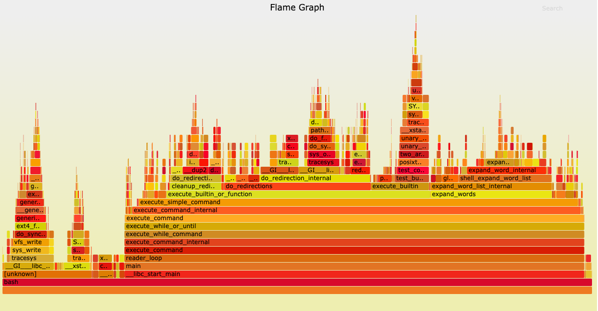
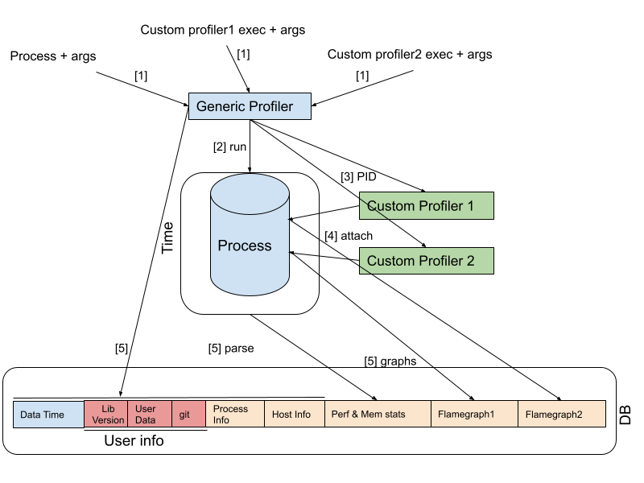

# Tech Spec: Performance Evaluation & Monitoring for Single Cell

# Goal

Single-cell datasets and queries run across multiple platforms (Mac OSes, Linux, AWS VMs, etc.) and across multiple layers of software stack (Python, C++ and R as of now!). Performance and memory monitoring for such applications is essential because all of the following are important:

- Detection of regression as new features are added
- Performance comparison across different platforms and languages to spot memory and execution time hot spots for optimization
- Measuring the system scalability as the workload grows in size
- Profiling a _suite_ of various operations, which can be run as a unit, reproducibly
- ~~Having a tool for customers to monitor and debug their workloads~~

The goal of this process is to provide a multi-layer profiler -- consisting of a generic top profiler and multiple custom , language-dependent profilers -- to help detect potential regression caused by bugs or new releases of TileDB-SOMA ~~and also help the customers detect performance issues in their queries~~.

# Terminology & Concepts

**SOMA:** The goal of SOMA (“stack of matrices, annotated”) is a flexible, extensible, and open-source API providing access to annotated, 2D matrix data stored in multiple underlying formats and systems.

**FlameGraph:** A flame graph visualizes a distributed request trace and represents each service call that occurred during the request’s execution path with a timed, color-coded, horizontal bar.

# Requirements

**Basic requirements:**

- Our solution should be able to provide timing metrics for a full run.
- Our solution should be able to provide memory metrics for a full run.
- Our solution should be able to be incorporated into a release pipeline to protect against / debug regressions in code.
- Our solution must support querying and/or reporting per-process stats.
- In addition to perf/mem metrics, our solution must capture env/context (such as host info) for the run as well.
  **Advanced requirements:**

- Our solution should be able to provide a breakdown of how time was spent in different components / queries
- Our solution should be able to provide a breakdown of how memory was used in different components / queries
- Our solution should be able to aggregate metrics from multiple components into a roll-up view for internal use (may be useful for the third party as well)
- ~~[P2] Our solution should be able to be released to clients to help them identify and improve poor performing queries~~

## Future Work

This work is open-ended as there is a chance to add more and more custom profilers to the system. Also right now, we plan to use flamegraph to connect custom profilers and the generic main profiler. This can also be extended by using different intermediate formats or objects.

## Open Sourcing Strategy

This work can be easily open sourced as the profiling is a very general tool (both generic and custom ones) and can benefit any computationally heavy service or infrastructure project.

# Design

Given the complexity of the system and layers of software involved, we are taking a hierarchical approach (multilayer) to implement an efficient and useful profiler:

## Generic Profiler

To address the mentioned basic requirements, at the top level, we use a generic and simple profiler which only tracks end-to-end execution time and memory metrics (peak memory, page faults, etc.) of the executed queries.

This profiler uses a commonly available tool such as **_time_** to keep track of this high level information across days and releases in a small database.
The early version can be using just the filesystem where key will be process (folder) the date/time (file in that folder) and value will be the file content.
And we can use GitHub to make it shared and versioned.

In the future, we can use [SqliteDict](https://pythonhosted.org/sqlite_object/sqlite_dict.html) K/V database, TileDB or DynamoDB as other alternatives) across different platforms.

As the profiler runs the application process, a new record will be generated and stored. The record associated with each run has the following schema:

- **Key:**
  - _Process Information (application and its arguments)_
  - _Date_
  - _Time_
- **Value:**
  - _Host information_
  - _User Defined data_
    - _Libraries version_
    - _Git commit SHA1_
    - _Description_
    - _TileDB stats_
  - _Tag_
  - _Time (real time, sys time, user time)_
  - _Memory (peak, max resident, page faults, …)_
  - _Custom Profiler 1 output_
  - _Custom Profiler 2 output_

As can be seen, the key is a combination of **_Date_**, **_Time_** and **_Process Info_**. The idea is to make it easy to query across time for a given process. The value consists of executed process detail info, library versions (releases and PR perhaps too). Additionally, the user can add platform information (like SOMA implementations) and git **_SHA1_** and a _description_ for the benchmark. **_Tag_** is a value linking multiple benchmarks (a suite of runs). Finally, the profile information also includes time and memory metrics. Additionally, it includes the output info of custom profilers. Custom profilers will be discussed in the next section.

There are multiple benefits to have this top-level profiler:

- Getting the **_time_** utility across platforms is a practical task and can be implemented in a short amount of time.
- Performance and memory regressions and trends can be easily detected by querying this database. We can detect performance or memory issues across PRs, releases or platform changes

While this is a great tool to show us the trends, it doesn’t give any details for the found performance or memory anomalies. That is where the second-level profilers (custom profilers) come into play.

## Custom Profilers

If a more detailed breakdown of the software stack is needed (for example if we suspect a new unexpected hot spot has taken place after a release), we need a tracing profiler to extract time or memory spent/used by each component in our software stack. To achieve this goal, one or more custom profilers (language dependent) can be invoked by the generic profiler. In other words, these profilers work as a plugin into the generic profiler that can be enabled by the user. Once finished, the generic profiler stores the output of these profilers in its database for the users.

### Custom Profiler API

We studied a good number of Python profilers including [cProfile](https://docs.python.org/3/library/profile.html), [line_profiler](https://pypi.org/project/line-profiler/), [tracemalloc](https://docs.python.org/3/library/tracemalloc.html), etc. While each of these profilers provides great information, the format and output of them is different and supporting them for languages across different systems can be challenging. Instead, we decided to have custom profilers that use a consistent format for their outputs. This provides a common and useful interface into the generic profiler.

We decided to use [flamegraph](https://github.com/brendangregg/FlameGraph) as this common interface. The **_flamegraphs_** are a very popular interactive way of tracking performance metrics across software components. Therefore, the generic profiler will be given a set of custom profilers (and their arguments) to run and simply expect each profiler to generate a new **_flamegraph_** of the program software stack in a particular location and it adds the generated files to the database as well. Given the overhead of trace-based profilers, custom profilers are always going to be optional. For example upon detecting a regression in the generic profiler DB, we can rerun the application with the custom profiler to get the **_flamegraphs_** of the application. For R, we can use [xProf](https://github.com/atheriel/xrprof) and for python, we can use [pyFlame](https://uwekorn.com/2018/10/05/pyflame.html) for this purpose.

### Benefits

- A major benefit of this design is that the profilers (both generic and custom ones) are not necessarily targeted toward single cell applications and can be used for any services.
- Another benefit of this design is the fact that the generic profiler can be implemented and deployed in a reasonable amount of time opening the door for low-overhead perf/mem monitoring.
- The third benefit of the design is that it can be easily extended by adding more custom profilers for different languages and software stack.

### Drawbacks

One drawback here is limiting custom profilers’ API to flamegraph. As mentioned earlier, there are many profilers with different output formats. One possible solution to this problem is to allow the byte array associated with each custom profiler in the DB schema to be open to different interpretations which, while more scalable, is a less secure solution.

## Architecture

As shown in the figure, the following steps take place as a part of the process of profiling:

- First the generic profiler gets a request to run a process along with a group of custom process information (1).
- As it starts the process using the **_time_** utility (2), it also starts the custom profilers by providing the process ID of the initiated process (3) so they can attach themselves to that process (4).
- Once execution finishes,the **_time_** utility provides the time and performance metrics which are extracted with parsing (5) while the custom profilers provide **_flamegraphs_** of their metrics (5) and all that information plus some other fields get stored as a record in DB (5).

## Metrics & Alerts

A metric for performance and memory regression should be designed and implemented which supports profiling processes and also querying of profile stats.
The use of custom profilers can be conditional on detection of regression. This tool supports querying its data for investigating regressions or hotspots.

## Security & Data Privacy

The central DB can pose a risk if that gets compromised as it reveals the history of all the profiling runs.

## Estimated Cost

This design does not require adding new machines (nodes). It only relies on installation of the **_time_** utility and custom profilers across the nodes. The other cost is the storage needed for the central DB.

# Implementation

## Engineering Steps

- We need to make sure all nodes across our controlled environment for profilers have **_time_** utility. Also need to figure out the right flags for them to extract the memory in addition to performance metrics.
- A way to have a central DB (Filesystem only or **_SQLiteDict_**) across the environments (EC2 and developer machines).
- As more custom profilers are added to the system, they must be tested and added to the controlled environment gradually.

# References

- For TileDB-SOMA spec please refer to this [document](https://github.com/single-cell-data/SOMA/blob/main/abstract_specification.md).
- Details on [SOMA](https://github.com/single-cell-data/SOMA)
- Flamegraph [description](https://www.datadoghq.com/knowledge-center/distributed-tracing/)
- SqliteDict [notes](https://pypi.org/project/sqlitedict/)
- [TileDB](https://tiledb.com/)
