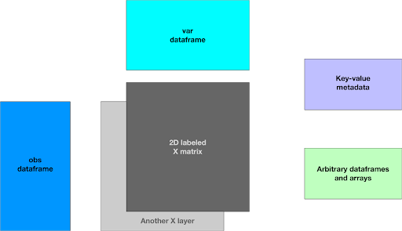

## Unified Single-cell Data Model and API

Opportunity:

* The programming language and toolchain used to analyse single cell data determines the format that the data will be published in. These language- and toolchain-driven data silos inhibit use cases like model training that require bringing data to tools.
* Best-in-class algorithms are often available in only a single language ecosystem or toolchain, or take substantial effort to make portable.
* Multimodal data, which are becoming more common, lack standardization and support--particularly in the python ecosystem.
* Data are becoming large enough that moving serialized objects around will soon be infeasible - cloud optimized formats will be required to support the next analysis phase, and out of core processing is becoming increasingly important.

We envision an API that enables users to slice and compute on large (100s millions observations) single cell datasets stored in the cloud using the AnnData, Seurat, or Bioconductor toolchains.

To get started, we will focus on enabling data to be used by all major toolchains and on nailing the multi-modal data use cases. We believe this will be sufficient to drive API adoption. With data silos broken, larger data use cases will be enabled and the need for a cloud-optimized data format will be more widely felt.

Initial Focus:

* A standardized single-cell container, with (basic) read & query access to the data in the container.
* Import/export from all commonly used in-memory formats (eg, AnnData, SingleCellExperiment, Seurat)
* Access to underlying native (eg, TileDB) objects to allow advanced use cases
* Python and R support

Longer term goals:

* Native support in the popular toolchains, reducing the reliance on on-the-fly conversion (eg, [anndata2ri](https://github.com/theislab/anndata2ri))
* Incremental modification and composition of the dataset
* Optimizations required for performant analysis

The core functions of the initial API are:

* Compose a "sc dataset" Python object out of pre-existing TileDB arrays.  This object is the composition of one or more sc_groups (terms defined below).
* Simple access to sc_dataset/sc_group properties (eg, obs, var, X) and ability to slice/query on the entire object based on obs/var labels.
* For Python, Import/export an in-memory AnnData object (for subsequent use with AnnData/ScanPy) from _either _a slice/query result or the entire object.  For R, same basic function but to/from Seurat and SingleCellExperiment

This draft, written by TileDB and CZI, proposes an API for single-cell data that attempts to unify the data models followed by [AnnData](https://anndata.readthedocs.io/en/latest/), Bioconductor’s [SingleCellExperiment](http://bioconductor.org/books/3.13/OSCA.intro/the-singlecellexperiment-class.html), [Seurat](https://github.com/satijalab/seurat/) and [CXG](https://github.com/chanzuckerberg/single-cell-explorer/blob/main/dev_docs/cxg.md). We are seeking community feedback.

It first describes a general data model that captures all the above frameworks. Then it explains how TileDB can implement this model on-disk so that we have a concrete implementation reference. Next, it describes how TileDB can query this model with its generic array API “soon” (as some minor features are a work in progress). Subsequently, it proposes a more single-cell-specific API that can easily be built on top of TileDB’s, in order to hide the TileDB-specific implementation and API. We will focus only on Python for now for simplicity. Finally, it concludes with a list of features that will need to be implemented on the TileDB side in order to have a working prototype very soon.

## The Data Model

Based on our research and avoiding a lot of the jargon, there are the following “components” in all the single-cell projects:

* One or more **labeled 2D arrays** that we will call `X` (similar to AnnData and CXG - Seurat and SingleCellExperiment call them `assays`, and Loom calls them `layers`).
* A **dataframe** called `obs`, which contains the row labels for the `X` arrays (in SingleCellExperient the `X` arrays are transposed, so `obs` are the column labels).
* A **dataframe** called `var`, which contains the column labels for the `X` arrays (in SingleCellExperient the `X` arrays are transposed, so `var` are the row labels).
* Any **key-value metadata**.
* Any other number of auxiliary **dataframes** and **arrays**.

In addition to the core model above, there exist various means of representing filtered & transformed datasets, and associating data from different assays/modalities.  We propose modelling as:

* A **sc_group**, composed of the above elements -- a self-consistent set of `X` matrices (aka _layers_) and their axis labels (`obs`,`var`), where all three share consistent shape and indexing labels.  Every `sc_group` exists within a `sc_dataset`.
* A **sc_dataset**, which is a set of named `sc_groups`.  Primary use is representing a collection of related annotated matrix data, including progressively filtered data (raw vs norm), related assays with different labels/shape, etc.

Notes:

* A “labeled 2D array” is just a 2D array that can be sliced potentially using string values, or values of any data type other than the typical integer matrix indices.
* The way a labeled 2D array is implemented is _specific to the storage engine that implements it_. For example:
    * It could be **dense**, in which case there must exist some kind of a mapping between the string labels and the integer indices.
    * It could be **sparse**, in which case the labels could just be the string dimensions.
* The auxiliary dataframes and arrays can be anything (e.g., `reducedDims` in SingleCellExperiment). These should be able to be efficiently joined with `obs` and `var` to produce the labels to query `X` with.
* There can be more than one `X` arrays, and we will distinguish between two cases:
    * They _share_ the same labels/coordinates and non-empty cells. In that case, we will talk about “layers” and use an intuitive API (see “attributes” in the TileDB implementation).
    * They _do not share_ the same labels/coordinates. In that case, we will talk about separate arrays with their own coordinates.

The following image summarizes the model for an **sc_group**, in the case where a set of `X` array layers shares the `obs` and `var` dataframes. This can be generalized to _multiple different groups_ of what is depicted below to capture cases where the  `X` array layers do not share the `obs` and `var` dataframes.



And for the entire **sc_dataset**, containing one or more named **sc_group**:

```
sc_dataset                     # sc_dataset
    |_ sc_group_1              # sc_group (contents as in the figure)
    |_ sc_group_2              # sc_group (contents as in the figure)
    |_ ...
```

In the most basic case, we need three queries:

* The first uses any available dataframe and issues any query (even a multi-way join if needed), which involves the `obs` dataframe and produces a set of **row labels**, let’s call them  `obs_labels`.
* The second uses any available dataframe and issues any query (even a multi-way join if needed), which involves the `var` dataframe and produces a set of **column labels**, let’s call them  `var_labels`.
* Then the query will take as input an `X` array and potentially one of its “layers” (let’s denote that by `X[layer]`), `obs_labels` and `var_labels`.
* The result of this query `Q(X[layer], obs_labels, var_labels)` can be represented in two forms:
    * **Dense**, e.g., a 2D numpy array
    * **Sparse**, e.g.,
        * 3 1D numpy arrays, one for the row indices, one of the column indices, and one for the `X` values, or
        * A pandas dataframe indexed on row and column indices for fast search

## Exemplary Use Cases

A handful of simple use cases to demonstrate possible usage.

### Cloud Extraction to Scanpy/AnnData

Unified single cell data corpus available on the cloud, at s3://giant-dataset/.  User's can open, slice and extract data in their format of choice.  In this case, we are extracting it as H5AD/AnnData. A similar method should be available for BioConductor & Seurat toolchains.

```
    import tiledb.sc as sc

    with sc.open("s3://giant-dataset/") as full_corpus:
      obs_filter = sc.filter(
    	"cell_type in ['lung', 'heart'] and organism == 'human'"
      )
      query = full_corpus[obs_filter, :]
      adata = query.to_anndata()  # instantiates in memory
      adata.write_h5ad("my_new_data.h5ad")
```

### Cloud Extraction - simple analysis in notebook

Related, the user may wish to perform the same extraction from a cloud dataset, but simply introspect the cloud slice in a notebook and calculate mean expression for a set of genes and a type of cell/tissue:

```
    import tiledb.sc as sc

    with sc.open("s3://giant-dataset/") as full_corpus:
    	obs_filter = sc.filter("tissue == 'tongue'")
    	var_filter = sc.filter("pathway == 'ABCA1'")
  		query = full_corpus[obs_filter, var_filter]

		obs = query.obs.to_df() # 1D DF indexed by obs_label
		var = query.var.to_df() # 1D DF indexed by var_label
		X = query.X.to_df()  # 2D DF indexed by obs_label, var_label

		# calculate mean expression per gene
    avg_expression = var.join(
        X.groupby(['var_label']).agg(
            avg_exp=('data', "mean")
            )
    )
```

### Cloud Extraction & Analysis using ScanPy

A more complicated scenario where the user slices out of a cloud-based dataset, and wants to do some complicated analysis using ScanPy, and then save the modified result to their local disk as an AnnData/H5AD

```
    import tiledb.sc

    with tiledb.sc.open("s3://giant-dataset/") as full_corpus:
    	obs_filter = sc.filter("tissue == 'tongue'")
    	var_filter = sc.filter("pathway == 'ABCA1'")
      	query = full_corpus[obs_filter, var_filter]
    adata = query.to_anndata()

    # analyze & annotate AnnData....
    import scanpy
    scanpy.tl.rank_genes_groups(adata, "cell_type")
    # etc ...

    # and save to local disk
    adata.write("my_data.h5ad")
```

### Storing multiple X arrays/layers in a "dataset"

10x has two assays that generate different data types, but I think they reduce to the similar problems: ATAC/RNA multi-omics and CITE-seq (protein + RNA)

### ATAC/RNA multi-omics

These experiments generate two data modalities from the same cells, and have separate filtering and analysis steps. These measure a subset of the same set of "gene" annotations, but might have a non-zero difference. So, they might produce the following X matrices (shapes in parentheses):

(m, n): RNA.raw

(o, p) RNA.filtered (some genes and cells masked)

(o, p) RNA.normalized (a transformation of RNA.filtered)

(m, n) ATAC.normalized (currently "raw" are not feature x object matrices)

(x, y) ATAC.filtered (some genes and cells masked)

The above can be represented by the following:

* There will be a super-group containing four sc_groups:  RNA.raw, RNA.filtered, ATAC.normalized and ATAC.filtered
* Each group will have separate obs/var dataframes, and separate X arrays

### RNA

* RNA.raw - along with its unfiltered obs & var, will be represented as a sc_group with **m** observations and **n** variables. The RNA.raw X will be a TileDB array with a single attribute containing the RNA.raw layer.
* RNA.filtered & RNA.normalized are contained in a single sc_group with **o** observations and **p** variables. The filtered and normalized values can be either stored in a single array if they have the same coordinates, or as two arrays if they differ in which cells have a value.

In the above cases, it is most likely that the X arrays will be sparse.

ATAC is similar.

### CITE-seq

This is similar to ATAC/RNA except that the two modalities measure _different, non-overlapping feature sets _(protein and RNA). This assay might produce the following X matrices:

(m, n): RNA.raw

(o, p) RNA.filtered (some genes and cells masked)

(o, p) RNA.normalized (a transformation of RNA.filtered)

(m, l) Protein.raw (note: _dense _data, but m >>> l. Usually ~ 50-200 features total)

(x, y) Protein.filtered (some genes and cells masked)

(x, y) Protein.normalized (a transformation of protein.filtered)

The above can be represented in a manner similar to ATAC/RNA, with exceptions:

* Protein X data would be stored in dense arrays

## On-disk Implementation with TileDB

In TileDB, we will implement the above as follows:

* All 2D labeled `X` arrays will be **2D sparse**, with **string** dimensions.
* If the `X` array has layers that share the coordinates and non-empty cells, then each layer should be an **attribute** of the same array.
* The `obs` dataframe should have an arbitrary number of columns, but one of them should be the same labels as the coordinate of the **first dimension** in `X`.
* The `var` dataframe should have an arbitrary number of columns, but one of them should be the same labels as the coordinate of the **second dimension** in `X`.
* Both `obs` and `var` dataframes will be implemented as TileDB arrays, with rich functionality for dimensions/indexing:
    * They can be **1D dense** if queries do not favor one column over the other(s)
    * They can be **ND sparse**, if a subset of N columns appear in most range queries over those dataframes
* If there are multiple `X` arrays that do not share the same non-empty coordinates and labels (e.g., multi-modal data), they will be stored in **separate arrays**.
* If the `obs` and `var` dataframes are common across multiple `X` arrays, we can keep a single copy of those. Any query on those labels will simply not return results, so both correctness and functionality are preserved.
* If the `obs` and `var` dataframes are not common across multiple `X` arrays at all, we can keep triplets of `obs` , `var` and `X` separately.
* Any other auxiliary dataframe and ND array can be a separate array with any schema (dense/sparse, shape, etc) depending on the application. These should act like any other table in a traditional database and should allow join queries with `obs` , `var` and `X`.
* All of these objects will be stored as an `sc_group` in a **TileDB group**.
* A `sc_dataset` will be a TileDB group, containing 1+ `sc_group`.
* The arbitrary key-value metadata will be modeled as **TileDB group metadata** (see the TODOs section at the end).

A full single cell dataset, composed of one or more sc_group, would look like:

```
sc_dataset                              # sc_dataset
    |_ sc_group_1                        # sc_group
    |     |_ __meta                     # key-value metadata
    |     |_ X                          # array
    |     |  |_ <timestamped_fragment>  # fragment for versioning 
    |     |              |_ layer_1     # attribute (X layer)
    |     |              |_ layer_2     # attribute (X layer)
    |     |              |_ …
    |     |_ rawX                       # Another X, diff layer coords
    |     |_ obs                        # obs array / dataframe
    |     |_ var                        # var array / dataframe
    |     |_ misc                       # any other array / dataframe
    |     |_ ...
    |_ sc_group_2                       # sc_group #2
    |     |_ ...
    |_ ...
```

## Queries Using TileDB’s Generic Array API

Most of the functionality can be implemented via TileDB’s (existing) generic API. Here is an example of querying `X` after filtering determining the `obs` and `var` labels.

```
# Get the obs labels
obs_array = tiledb.open(<obs_array_uri>)
obs_qc = tiledb.QueryCondition(<any query condition here>)
obs_labels = obs_array.query(qc = obs_qc, cols=["obs_labels"])

# Get the var labels
var_array = tiledb.open(<var_array_uri>)
var_qc = tiledb.QueryCondition(<any query condition here>)
var_labels = var_array.query(qc = var_qc, cols=["var_labels"])
```

Note that currently the query condition is applied only on attributes ([see docs](https://docs.tiledb.com/main/how-to/arrays/reading-arrays/filtering-attributes)). See the TODOs section in the end for our plan to implement a unified API for setting conditions across both attributes and dimensions. To filter on dimensions you currently need to use the `[]`, `df`, and `multi_index` APIs.

Note also that instead of using the Pythonic API to apply conditions on `obs_array` and `var_array`, you can use TileDB’s SQL integration with MariaDB. The result should be a 1D numpy array with the obs/var labels to be issued as label slices on the `X` array.

```
# Slice the X array
X = tiledb.open(<X_uri>)
res = X[obs_labels, var_labels]
```

If `X` has layers, querying them is as easy as:

```
# Slice the X array "layers"
X = tiledb.open(<X_uri>)
res = X[obs_labels, var_labels]["layer"]                # Option 1
res = X.query(attrs=["layer"])[obs_labels, var_labels]  # Option 2
```

Finally, reading group metadata looks like this:

```
# Group metadata
group = tiledb.open(<group_uri>)
value = group.meta["key"]
```

Note that the group key-value metadata is a work in progress (see the TODOs section in the end), but it will look pretty much like the above example.

We can add any missing API, e.g., listing arrays and subgroups within the parent group, etc.

## Proposed Single-cell (Python) API

This is a section that requires a lot of feedback from the community. The TileDB API described above is quite usable, but not specific to the single-cell domain. We assume that single-cell scientists/practitioners may wish for an API that “speaks the single-cell  language”, including facilities to ease integration with common toolchains. For simplicity, let’s assume that the library/API namespace is `sc` (instead of `tiledb` as used in the previous section).

A similar API can be imagined for other language ecosystems.

#### Create

```
import tiledb.sc as api 

# Compose sc_group from a TileDB group containing required arrays.
# Validates that the triple <obs, var, X> are all consistent &
# compatible.
# 
# Example validation/constraints:
#	* indexing dims exist and are of same type, etc
#	* all arrays are in the group
#	* all X layer defn's are valid
# etc.

# mapping between layer name and (array, attribute)
normalized_X_layers = {
	"counts": (<array_name>, <attribute_name>),
	"normed": (<array_name>, <attribute_name>),
}
# compose a sc_group
normalized_group = api.Group(
obs=<obs_array_name>, obs_index='obs_dim name',
var=<obs_array_name>, var_index='var_dim_name',
X=normalized_X_layers,
aux=None | [<array_name>,...],
meta=None | dict,
)
unfiltered_group = api.Group(
obs=<obs_array_name>, obs_index='obs_dim name',
var=<obs_array_name>, var_index='var_dim_name',
X={"counts": (<array_name>, <attribute_name>)},
aux=None | [<array_name>,...],
meta=None | dict,
)
# compose a sc_super_group
api.create(
	<super_group_uri>,
groups={
    "normalized": normalized_group, 
    "unfiltered": unfiltered_group
    },
default_group="normalized",
)
```

#### Import/export

```
# Create from in-memory AnnData/ScanPy. Suggest a similar approach 
# for R ecosystem (Seurat & SingleCellExperiment)
import anndata
adata = anndata.read_h5ad("file.h5ad")
api.create(<group_uri>, anndata=adata)

# To AnnData in-memory object.
# Similar approach for R (Seurat and SingleCellExperiment)
# Requires further elaboration on conventions - some initial
# thoughts in a later section.
adata = sc_group.to_anndata()
```

#### Open/Close

```
# load from URI.  If <uri> is a supergroup, will return the default
# sc_group in the sc_super_group.  Also works as a Python context
# manager.
# This open function, similar to the functionality supported in
# TileDB, can take as arguments timestamps to support versioning 
# and time traveling.
sc_group = api.open(<uri>)

# closes all arrays in group
sc_group.close()
```

#### SC_Group attributes

```
# shape
sc_group.shape  # shared across obs, var and X
```

#### Supergroup

```
# get the supergroup - returns dict-like mapping type
super_group = sc_group.groups

# get a named group from the supergroup
raw_group = sc_group.groups['raw']

# iterate over the supergroup
for sc_group_name, sc_group in super_group.items():
	print(sc_group_name, sc_group.shape)
```

#### Query/Slice entire sc_group

```
# Create a query object based upon obs/var labels. Slices obs, var & X
with api.open(<uri>) as sc_group:
    sc_group_slice = sc_group[
    <obs_filter_condition>,
    <var_filter_condition>
    ]

# or, to configure query (eg, incremental results, constrain result
# to partial attributes, etc). 
with api.open(<uri>) as sc_group:
    sc_group_slice = sc_group.query(
    	return_incomplete=True,
    	<option>=<value>, ...
    )[<obs_filter_condition>, <var_filter_condition>]

    for partial_result in sc_group_slice:
    	...

# export slice as in-mem AnnData object
adata = sc_group_slice.to_anndata()

# export obs/var query as dataframe or dict-like
sc_group_slice.obs.to_dict() # return multi-dict
sc_group_slice.obs.to_df() # return df indexed by var label
sc_group_slice.var.to_dict() # return multi-dict
sc_group_slice.var.to_df() # return df indexed by var label

# export X or aux arrays
# dense
sc_group_slice.X["layer"].to_array() # dense ndarray
sc_group_slice.aux['arrayname'].to_array() # dense ndarray
# sparse - dataframe, with 2D index (obs_label, var_label)
# or dict-like (COO): {
#    "obs_labels": 1d_ndarray, 
#    "var_labels": 1d_ndarray, 
#    "layer_data": 1d_ndarray
# }
sc_group_slice.X["layer"].to_df()
sc_group_slice.X["layer"].to_dict()
sc_group_slice.aux['arrayname'].to_df()
sc_group_slice.aux['arrayname'].to_dict()
```

#### Sub-array access for advanced uses requiring TileDB API

```
# Accessing sc_group subarray: X, obs, var.
# Returns TileDB array
sc_group.X["layer"]  # return opened array
sc_group.var  # return opened array
sc_group.obs  # return opened array
# Other auxiliary arrays associated with the sc_group
sc_group.aux['array name']  # return opened array
```

We should allow for extreme functionality via introducing a query function for all arrays and dataframes (similar to what we do in TileDB), so that we can pass configuration options and arguments, e.g., for slicing specific dataframe columns, getting the result back in dense or sparse form, etc. The goal is not to be complete here, but rather to start with an API that can get us started and that is also flexible enough to be extended in the future.

### Filter Condition DSL

Proposing something roughly analogous to Pandas "filter" operations, but encoded in a simple string DSL:

* Equality and ordering (==, &lt;, >, !=, etc)
* Group membership (in)
* Compound expressions (and, or)
* Negation (not)
* Sub-expressions (parenthetical grouping)

An example of this is the [TileDB QueryCondition](https://github.com/TileDB-Inc/TileDB-Py/blob/dev/tiledb/query_condition.py#L16) class.

The filter conditions can filter any "column" in the underlying array (eg, if a TileDB array, will filter either dimension or attribute values).

Examples of the idea:

```
# filter for all matching labels
tissue_type == "heart"

# contained in
organism in ["mouse", "human"]

# compound
tissue == "lung" and cell_type_term_id == "CL:1001603"
tissue == "lung" or tissue == "heart"
```

## To/From AnnData

The `api.create()` and `sc_group.to_anndata()` functions imply a conventional mapping between these two objects.  Some initial thoughts which need expert input from the ScanPy team:

1. AnnData is unable to represent an arbitrary number of "groups", only supporting two:  default (usually filtered) and "raw". This is not a problem for `api.create()`, and only manifests when converting `to_anndata()`.  Suggested approach:
    * Support the `to_anndata()` method _only_ on a single sc_group.  If the user wants to convert and concatenate multiple groups, they do that using AnnData API.
    * The conversion to AnnData ignores AnnData.raw (ie, raw is set to None)
2. AnnData X and layers properties are separate objects/concepts, whereas in this API they are unified (as they are in Loom).
    * When converting **to** AnnData;
        1. We pick an X layer to populate the AnnData X property. This could be done with a user-specified param or by convention (eg, the "first" one).  As there is often only a single layer in a dataset, a default with user override would typically work fine.
        2. All other layers go into the AnnData.layers property.
    * When converting **from** AnnData:
        3. The AnnData X property is is stored as X["X"]
        4. The contents of AnnData.layers is stored in X with the same name it had in the AnnData layers mapping.  If any layer is named "X" (ie, name collision), we could either automatically alias or require a user specified name.
3. Obs and var conversions for a single group should be straightforward, with the exception of some type system differences between AnnData and TileDB and (temporary) restrictions on Unicode strings in TileDB dimension indices.  For example, TileDB does not support Pandas Categorical and they are commonly used by AnnData users.  Ditto for booleans (which typically are cast to uint8 or char/S1). Most of these issues can be ignored for now as they are already covered by their respective TileDB Python and R interfaces:
    * The Unicode issues will go away eventually, and in the meantime we can use the same conventions as TileDB uses elsewhere (to_pandas(), df[], etc)
    * Pandas categorical can be left to the user to apply after they run to_anndata(), eg, by using the [AnnData.strings_to_categoricals()](https://anndata.readthedocs.io/en/latest/generated/anndata.AnnData.strings_to_categoricals.html#anndata.AnnData.strings_to_categoricals) function.
    * A default mapping of type systems can be established for the remainder, eg, when creating from AnnData, a Pandas dataframe column of type **bool** will be cast to uint8.  Most, eg, np.object will error.  Most of this is already in place in the TileDB-Py and TileDB-R interfaces, and we can simply use it it.
